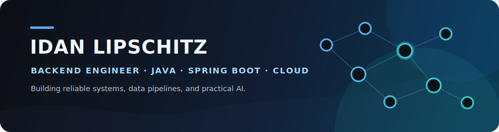

  

  <strong>Backend Engineer at XM Cyber</strong> · B.Sc. Computer Science at Reichman University

  
  

## About me

I build reliable backend systems with **Java and Spring Boot**, with hands-on experience in data ingestion, REST API test automation, SQL analytics, and cloud-native delivery. I also enjoy applying Python and modern AI/ML techniques to practical problems.

- **Backend engineering:** REST APIs, data pipelines, distributed systems, SQL
- **Quality and delivery:** REST-Assured, JUnit, CI/CD, Kubernetes, Helm
- **Applied AI/ML:** RAG, agent workflows, dimensionality reduction, classification

## Toolbox

  
  
  
  
  
  
  
  
  

## Featured work

<table>
  <tr>
    <td width="50%" valign="top">
      <h3><a href="https://github.com/idanlips1/psychology-session-analyzer">Psychology Session Analyzer</a></h3>
      
An event-driven microservice system for processing therapy-session video and audio workflows.

      
<code>Python</code> <code>FastAPI</code> <code>RabbitMQ</code> <code>PostgreSQL</code>

    </td>
    <td width="50%" valign="top">
      <h3><a href="https://github.com/idanlips1/SpringBoot---Ecommerce">Spring Boot E-commerce API</a></h3>
      
A structured REST API for an e-commerce domain with persistence and JWT-based authentication.

      
<code>Java</code> <code>Spring Boot</code> <code>JPA</code> <code>PostgreSQL</code>

    </td>
  </tr>
  <tr>
    <td width="50%" valign="top">
      <h3><a href="https://github.com/idanlips1/rag-customer-support-agent">RAG Customer Support Agent</a></h3>
      
A policy-aware retrieval system that produces grounded customer-support responses.

      
<code>Python</code> <code>RAG</code> <code>Embeddings</code> <code>LLMs</code>

    </td>
    <td width="50%" valign="top">
      <h3><a href="https://github.com/idanlips1/self-correcting-data-agent">Self-Correcting Data Agent</a></h3>
      
A graph-based data-analysis workflow with validation, failure detection, and targeted retries.

      
<code>Python</code> <code>LangGraph</code> <code>Tool Calling</code> <code>Agents</code>

    </td>
  </tr>
</table>

### More projects

- [t-SNE from Scratch](https://github.com/idanlips1/tsne-from-scratch) — A from-scratch implementation of nonlinear dimensionality reduction.
- [Garage Management System](https://github.com/idanlips1/garage-management-system) — A C# application demonstrating object-oriented design and state management.

---

  <strong>Interested in backend systems, cloud architecture, and practical AI.</strong> 
  <a href="https://www.linkedin.com/in/idan-lipschitz-b061a8301/">LinkedIn</a> ·
  <a href="mailto:idanlips@gmail.com">Email</a>

